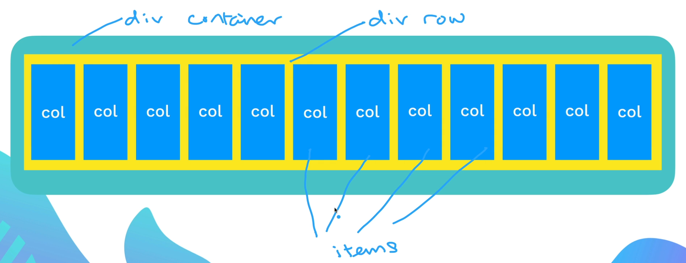
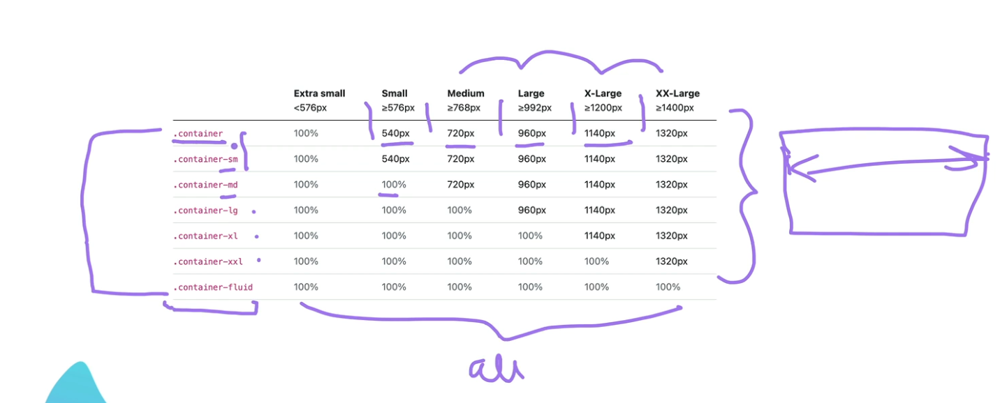
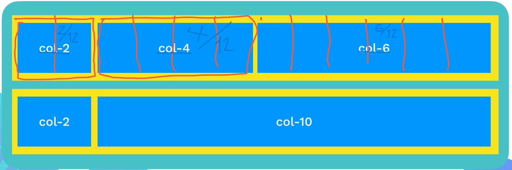

# Bootstrap

## What is Boostrap?

- It is a CSS framework, which means that it is a collection of premade CSS files.
- It is used as it makes styling your website as easy as just adding classes to elements.

## Bootstrap Layout

### 12 Column System

- It is made of three components:
    1. A `
` with the class `container`.
    2. Another `
` inside the container which will be of class `row`.
    3. Inside the row is where we will have the items, which will be layed out with the column system and have the `col` class.

- The 12 column system is responsive to your device size.

- You can also create columns with the classes:
    - `col-1`
    - `col-2`
    - `col-3`
    - `col-4`
    - `col-5`
    - `col-6`
    - `col-7`
    - `col-8`
    - `col-9`
    - `col-10`
    - `col-11`
    - `col-12`
- What this will do is it will allocate a certain amount of space based on which number you chose.

