# Flexbox

## `display: flex;`

- **Flexbox** is used to give structure to a webpage.
- It is applied by adding the CSS property [`display: flex;`](#display-flex) to a container.

### Example

#### HTML
```html
<div class="container">
    <div class="one">...</div>
    <div class="two">...</div>
    <div class="three">...</div>
</div>
```

#### CSS
```css
.container {
    display: flex;
    gap: 10px; /* this makes all elements have a 10px gap from each other */
    background-color: darkseagreen;
}
```
#### Result
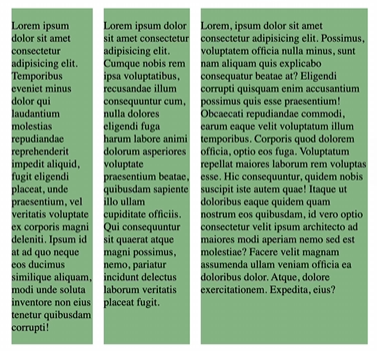

## `display: inline-flex;`

When [`display: flex;`](#display-flex) is applied then it creates a new container which acts like a `display: block;` and occupies a 100% of the width of the website. This is where [`display: inline-flex;`](#display-inline-flex) comes in handy. It allows multiple elements apart from the container element to be in the same line while using flex properties.

## Flex Direction

- Flex direction is a CSS property that is set by default to   `flex-direction: row;`.

### Main Axis and Cross Axis

- When you change [`flex-direction`](#flex-direction) you are changing the main axis and the cross axis. 
- When [`flex-direction`](#flex-direction) is set to `row` then the x axis or horizontal axis becomes the main axis and the y axis or vertical axis becomes the cross axis.
- Since the horizontal axis is the main axis all elements will go from left to right until there is no more space, which is when they will follow the cross axis, which in this case is the vertical axis.
- You can how it works in the image below.

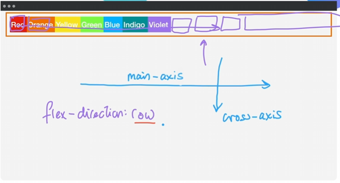

- The second option for [`flex-direction`](#flex-direction) is `column`.
- Just like how `row` makes the horizontal axis the main axis and the vertical axis the cross axis, `column` makes the vertical axis the main axis and the horizontal axis the cross axis.
- Since the vertical axis is the main axis all elements will go from up to down until there is no more space, which is when they will follow the cross axis, which in this case is the horizontal axis.
- You can how it works in the image below.

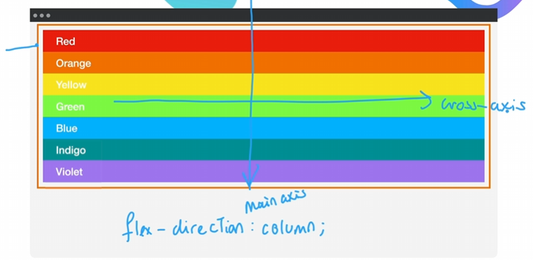

#### Flex Basis
- It is a CSS property that changes the height or width of each element in a flex container depending on the [`flex-direction`](#flex-direction).
- It is set to `auto` by default, meaning that it looks at the amount of content in each item and gives respective widths.
- When it is set to `0` it makes each item have equal width.

##### Example (`flex-direction: column;`)

###### CSS
```css
.container {
    display: flex;
    flex-direction: column;
    flex-basis: 100px;
}
```

###### Result
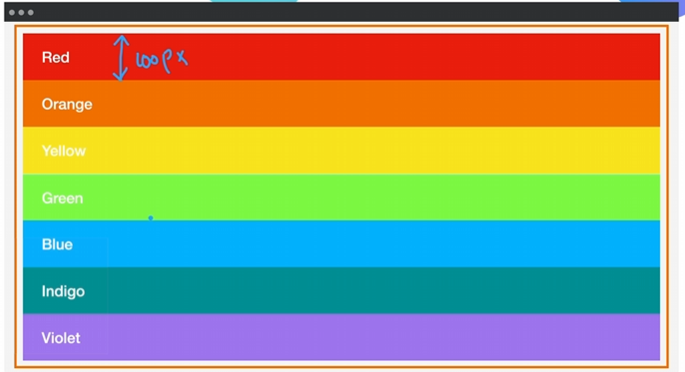

#### Example (`flex-direction: row;`)

##### CSS
```css
.container {
    display: flex;
    flex-direction: row;
    flex-basis: 100px;
}
```

##### Result
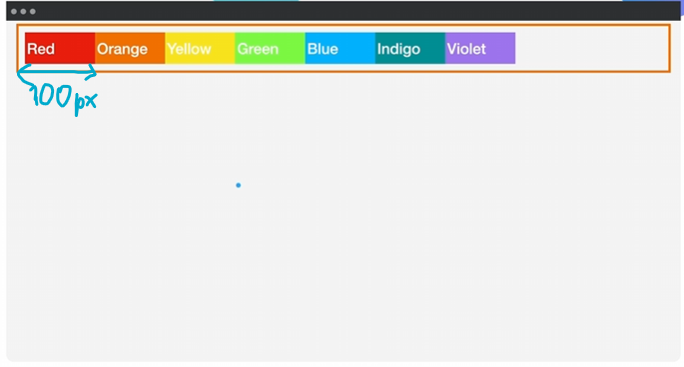

## Flex Layout

### Order

- Every flex item (child of a flex container) has a property `order` that defaults to `0`.
- It is set to the flex item.

#### Example

This is how the preview would look normally:

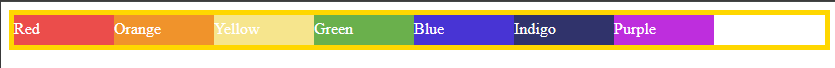

Let's add some **CSS**:

```css
.red {
    order: 1
}
```

This is how the preview would look after adding the above CSS:

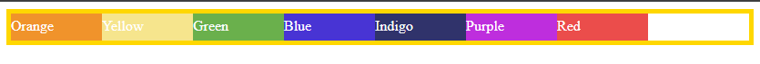

Do you see how the red box is now the last element? This happened because it's [`order`](#order) value was higher than the other elements. If the green box had its [`order`](#order) set to `2` then it would be after the red one.

### `flex-wrap`

#### `nowrap`

- By default the value for the CSS property [`flex-wrap`](#flex-wrap) is set to [`nowrap`](#nowrap).
- This means that items do not move on to the next line when space runs out and instead lose visibility as they go out of the window.
- The image below shows this property:

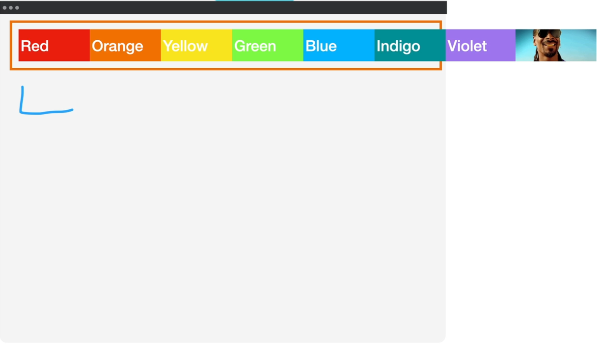!

#### `wrap`

- When the value for [`flex-wrap`](#flex-wrap) is set to [`wrap`](#wrap) then elements that would usually be outside of the window will instead move on to the next line.
- The image below demonstrates this property

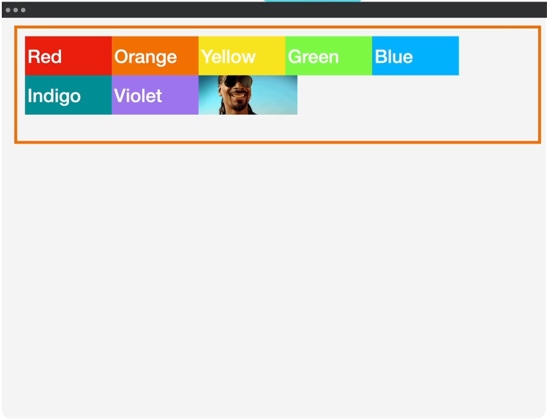

##### `wrap-reverse`

- It is the same as wrap but all elements start from the bottom of the container.

### `justify-content`

- It is a CSS property that is by default set to [`flex-start`](#flex-start) and distributes items on the main axis.
- It is applied to the container div.

#### `flex-start`

- When [`justify-content`](#justify-content) is set to [`flex-start`](#flex-start) then all elements in the container are postioned at the left side of the window.

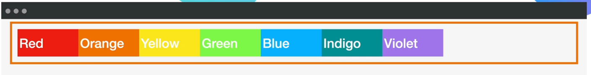

#### `flex-end`

- When [`justify-content`](#justify-content) is set to [`flex-end`](#flex-end) then all elements in the container are postioned at the right side of the window.

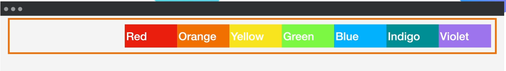

#### `center`

- When [`justify-content`](#justify-content) is set to [`flex-end`](#flex-end) then all elements in the container are postioned at the center of the window.

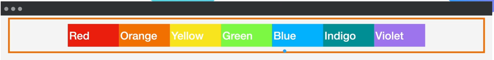

#### `space-between`

- When [`justify-content`](#justify-content) is set to [`flex-end`](#flex-end) then all elements in the container have equal space between each other while making sure the first and last items touch the edges of the container div.

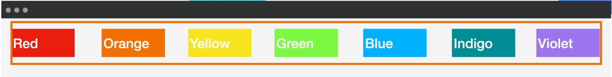

### `align-items`

- It is a CSS property that is by default set to [`flex-start`](#flex-start) and distributes items on the cross axis.
- To make use of this property you must have a bigger `height` set.
- It is applied to the container div.

#### `flex-start`

- When [`align-items`](#align-items) is set to [`flex-start`](#flex-start) then all elements in the container are postioned at the top of the window.

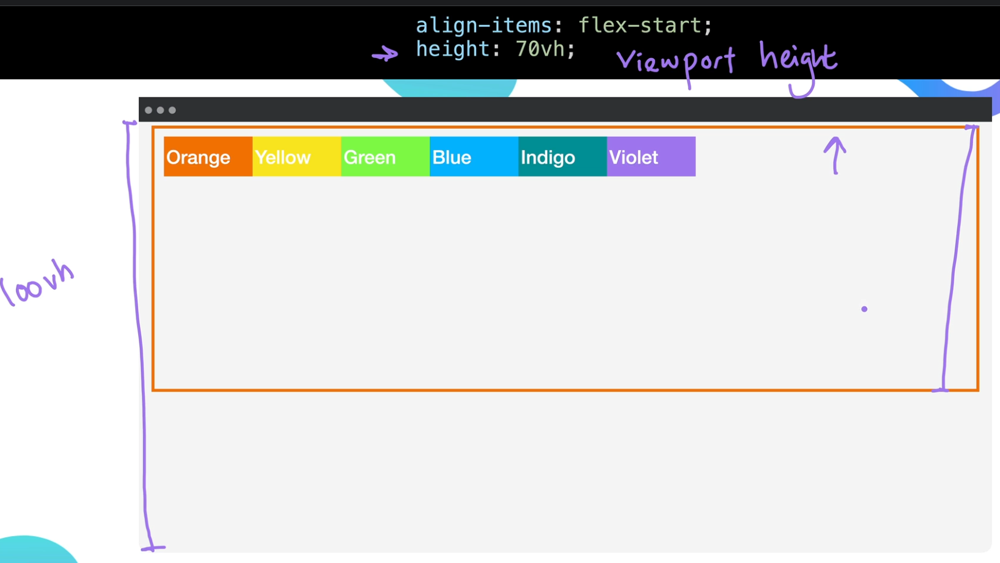

#### `flex-end`

- When [`align-items`](#align-items) is set to [`flex-end`](#flex-start) then all elements in the container are postioned at the bottom of the window.

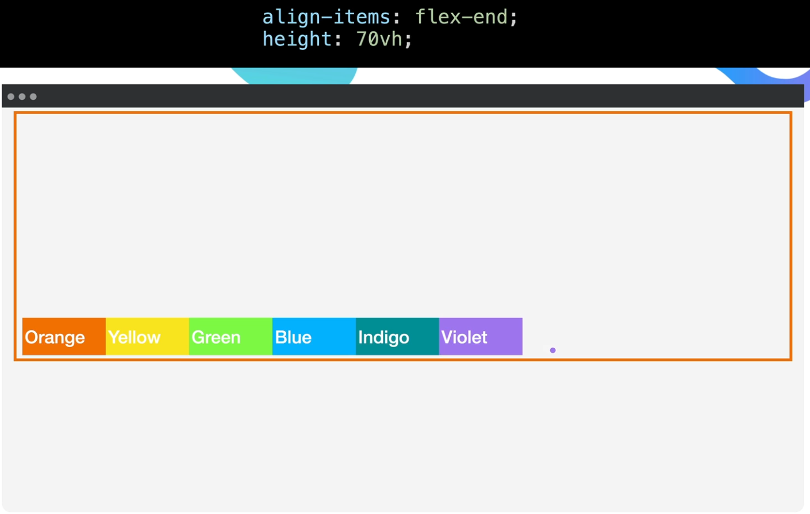

#### `center`

- When [`align-items`](#align-items) is set to [`flex-end`](#flex-start) then all elements in the container are postioned at the center of the window.

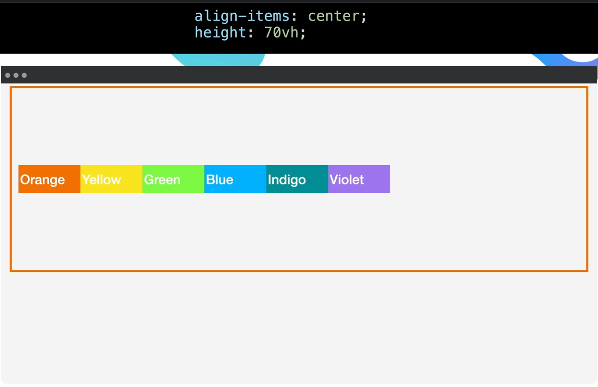

### `align-self`

- It is a CSS property that is used to set the alignment of a specific element.
- It is applied to a specific element in the container div.

### `align-content`

- It does the same thing as [`align-items`](#align-items) but only works when the [`flex-wrap`](#flex-wrap) property is set to [`wrap`](#wrap).
- When space runs out on the line then it moves elements to the next line and still positions it properly.

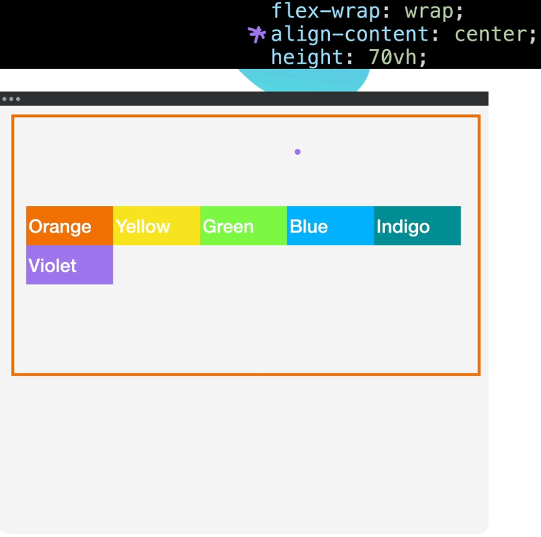

## Flex Sizing

- In flexbox, all flex items size's respond to the width of the window and change accordingly.
- But what if we want to set specific sizes?

### Flexbox Priority

- Flexbox has a priority list for which values it follows to determine the size of the flex items.
- Here is the list from highest to lowest:
    1. min-width/max-width
    2. [`flex-basis`](#flex-basis)
    3. width
    4. Content Width
- When the max-width is bigger than the [`flex-basis`](#flex-basis) then flexbox will follow the [`flex-basis`](#flex-basis).
- When the min-width is smaller than the [`flex-basis`](#flex-basis) then flexbox will follow the [`flex-basis`](#flex-basis).

### flex-grow & flex-shrink

#### flex-grow

- A CSS property that is applied to the flexbox container and allows the flex items to grow larger than the [flex-basis](#flex-basis) until the entire width of the container is filled.
- 1 = on, 0 = off.
- Default value: 0.

#### flex-shrink

- A CSS property that is applied to the flexbox container and sets everything to the [flex-basis](#flex-basis) by default and shrinks if it goes below the [flex-basis](#flex-basis).
- 1 = on, 0 = off.
- Default value: 1.