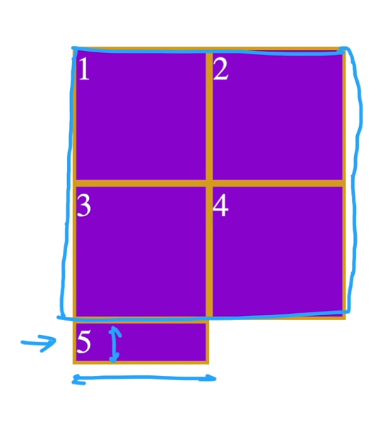

# Grid

- It is used to create complex layouts with CSS easily and used by adding `display: grid;` to a [grid container](#grid-containers).

## Flexbox vs. Grid

- Flexbox is better to line content on a 1D line.
- Grid is better to lay out content on a 2D grid.

### Which should I use?

- Both are often used together in websites.
- It depends on what you want to create.

## How to create one?


### HTML

```html
<div class="container">
    <p>...</p>
    <p>...</p>
    <p>...</p>
</div>
```

### CSS

```css
.container {
    display: grid;
    grid-template-columns: 1fr 2fr; /* 1:2 ratio */
    grid-template-rows: 1fr 1fr; /* 1:1 ratio */
    gap: 10px;
}
```

- `fr` is short for fraction.


### Result


## Grid Sizing

### `grid-template`

```html
<div class="grid-container">
        <div class="grid-item">1</div>
        <div class="grid-item">2</div>
        <div class="grid-item">3</div>
        <div class="grid-item">4</div>
        <div class="grid-item">5</div>
</div>
```

```css
.grid-container {
  display: grid;
  grid-template-rows: 100px 200px;
  grid-template-columns: 400px 800px;
}
```

**IS THE SAME AS:**

```css
.grid-container {
  display: grid;
  grid-template: 100px 200px /* rows */ / 400px 800px /* columns */;
}
```

### `auto`

```css
.grid-container {
  display: grid;
  grid-template-rows: 100px auto;
  grid-template-columns: 200px auto;
}
```

- `auto` for `grid-template-columns` will try to go to 100% size.
- `auto` for `grid-template-rows` will try to fit content.

### `fr`

- It stands for "fraction".

```css
.grid-container {
  display: grid;
  grid-template-rows: 1fr 2fr;
  grid-template-columns: 1fr 2fr;
}
```

- Since the second row is `2fr` and the first row is `1fr` the first row will be 2 times bigger than the first row.
- And it's the same way for the columns.
- The grid will grow and shrink depending on how much space is avalible while keeping the ratios proper.

### `minmax(min-width, max-width)`

```css
.grid-container {
  display: grid;
  grid-template-rows: 200px 400px;
  grid-template-columns: 200px minmax(400px, 800px);
}
```

- Using `minmax` gives freedom to the grid to keep within the `min-width` and `max-width`

### `repeat(amount of times you want to repeat it, size)`

```css
.grid-container {
  display: grid;
  grid-template-rows: repeat(2, 200px);
  grid-template-columns: repeat(2, 100px);
}
```

**IS THE SAME AS:**

```css
.grid-container {
  display: grid;
  grid-template-rows: 200px 200px;
  grid-template-columns: 100px 100px;
}
```

- This is used to save time in case we need to make alot of rows and columns.

### What if we don't have enough rows and columns?

```html
<div class="grid-container">
        <div class="grid-item">1</div>
        <div class="grid-item">2</div>
        <div class="grid-item">3</div>
        <div class="grid-item">4</div>
        <div class="grid-item">5</div> <!-- This is the extra one. -->
</div>
```

```css
.grid-container {
  display: grid;
  grid-template-rows: 200px, 200px;
  grid-template-columns: 200px, 200px;
}
```



- The extra div will follow the width of the other divs but its height will try to fit content.

#### `grid-auto-rows` and `grid-auto-columns`

- If you don't want this to happen there is a method.

```css
.grid-container {
  display: grid;
  grid-template-rows: 200px, 200px;
  grid-template-columns: 200px, 200px;
  grid-auto-rows: 300px;
}
```


- All new divs after the 4th one will have a height of 300px.

## Grid Placement

### Grid Keywords

#### Grid Containers

- The div that has the styling [`display: grid;`](#grid) set to it is known as the **grid container**.

#### Grid Items

- Children of a grid container are called **grid items**.
- They are made up of multiple [grid cells](#grid-cells).


#### Tracks

- When we create and size a grid, we create rows and columns which are collectively known as **tracks**.
- There are two types:
  - Row Tracks
  - Column Tracks


#### Grid Cells

- A **grid cell** is the smallest unit in a grid.
- They sit between the columns and rows.
- Multiple of them are used to create [grid items](#grid-items).


### `grid-column-start and `grid-column-end`

- It is used to decide which grid cell the first and last grid item will start its position from.

```css
.cowboy {
  grid-column-start: 2;
  grid-column-end: -1;
}
```


- Instead of starting from the first grid cell (`1`) it started from the second one (`2`).
- `-1`, which is the value of `grid-column-end`, the right side of the grid.
- **Extra info:** `1` is the left side of the grid.

```css
.cowboy {
  grid-column-start: 4;
  grid-column-end: 2;
}
```


- The cowboy emoji image was actually reversed (which you cannot see as it is symmetrical) but stayed in the same spot.

### `order`

- Just like [flexbox](./Flexbox.md/#order), grid also has an `order` property that does the exact same thing.

### `grid-area`

```css
.astronaut {
  grid-area: 2 /* grid-column-start */ / 1 /* grid-column-end */ / 3 /* grid-row-start */ /3 /* grid-row-end */;
}
```